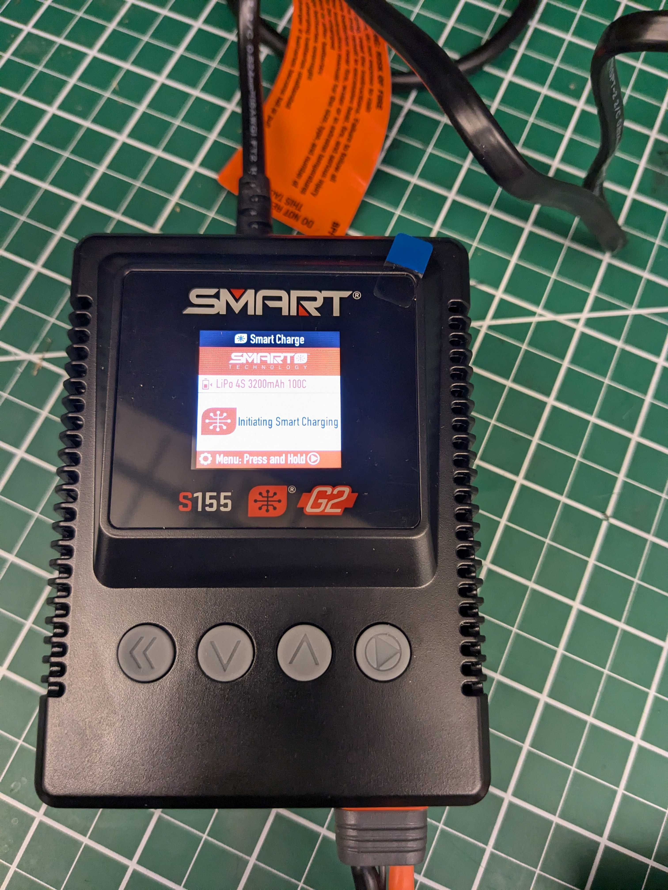
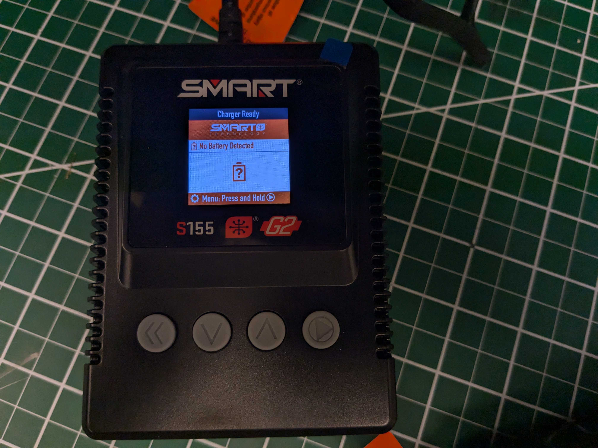
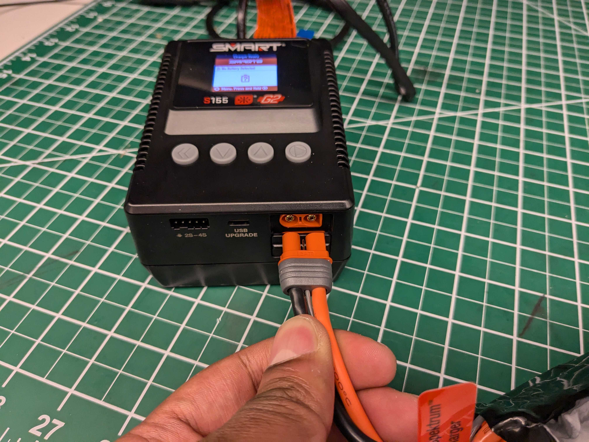
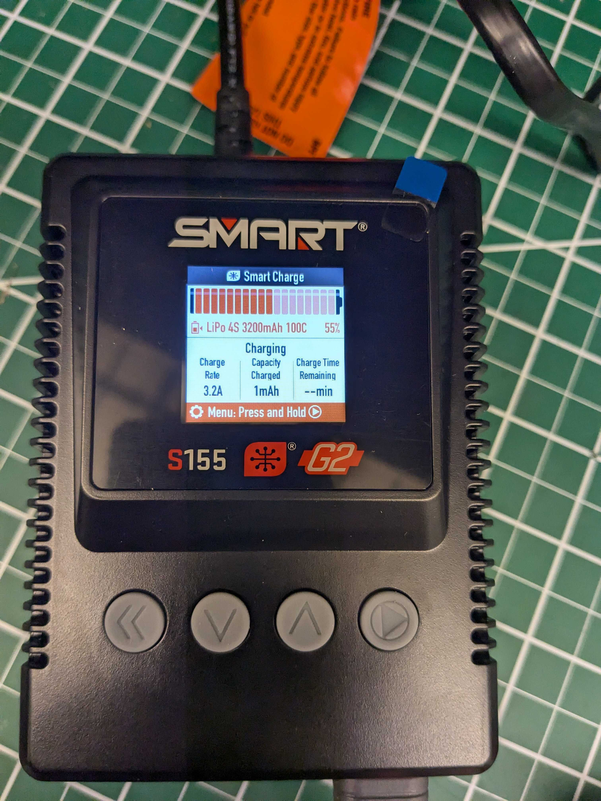

# Spektrum smart LiPo (Lithium Polymer) battery instructions:

Note that the instructions provided here are for the [batteries](https://www.spektrumrc.com/product/14.8v-3200mah-4s-50c-smart-g2-lipo-battery-ic3/SPMX324S50.html) used here and may not apply to generic lithium batteries.
Generally, a battery is composed of multiple cells in series (and sometimes also in parallel).

If you've never worked with lithium batteries before, you may have concerns about their safety.
While these concerns are valid, safe operation can be assumed as long as the following are ensured:

1) At the end of the charge cycle (and during the charge cycle), the cell voltages remain equal within the battery.
2) If the battery is to be left unused for more than 72 hours, the per-cell voltage should be brought below ~3.7-3.9 volts (this is not a hard requirement but it increases battery life)
3) **The individual cell voltages should never go below 3.0 volts**.
4) **The battery cells must never be punctured (no sharp tools near the battery!)**.
5) **Don't connect the positive and negative terminals of the battery directly**.
6) **Never leave charging batteries unattended**.
7) **Never keep the battery inside the car while charging; batteries should be kept in lipo-bags while charging**.
9) **Never use a puffy or bloated battery. Inform the instructor about it and get it replaced**.
   
The batteries used for this class have a built-in battery management system (**BMS**).
The combination of the BMS and the smart charger takes care of constraints 1) and 2).
The smart charger automatically determines the battery chemistry, voltage, capacity and so on, and the best way to charge it (while satisfying constraint 1).
The battery's BMS ensures 2 by automatically discharging the battery to 3.9 volts after 72 hours (of course, if the cell voltage is already below 3.7 volts, no change occurs).

Constraint 3) is ensured by the robot's buck converter and motor speed controller.
For clarity, a buck converter is a DC-to-DC power converter that can provide an output voltage below the input voltage.
The batteries used here are rated at 14.8 volts, however, during operation, their voltage will vary between 13.8-16.8 volts.
The computer in the robot requires a steady 12 volts or 5 volts to operate, which does not fluctuate as the motor pulls variable amounts of current from the battery.
The buck converter is responsible for ensuring this.

The buck converter used in the cars (details if you're interested)[https://www.mateksys.com/downloads/U4A2P_Manual_EN.pdf] will beep repeatedly (quite loudly) when the battery voltage per cell falls below 3.4 volts (13.6 V for the battery), this gives you about 5-10 minutes of leftover runtime.
At this point, it is **YOUR** responsibility to shut down the computer on the car and disconnect the battery as soon as possible.
To prevent significant over-discharge, the motor speed controller will also cut power to the motor below the aformentioned voltage.

Constraint 4) is fairly straightforward; don't bring any sharp tools (pens or blades) near the batteries, ever, and don't throw the battery around (treat it the same way you would treat a new iPhone).
If the robot gets into a harsh accident (unlikely), shut the system down, take the battery out, and get it replaced by the instructor.

Constraints 5), 6) and 7) are fairly easy to satisfy as well. Generally speaking, don't leave charging batteries unattended (you may leave for a bathroom break and come back, but don't leave them unattended for more than 20 minutes).
This is more of a precaution than a requirement; modern charging systems and batteries are safe enough that one _could_ leave them unattended but we don't recommend doing so.

## Steps for charging the battery:

### Step 1:
Plugging the charger into the wall socket should turn it on, give it a second to initialize.

   
### Step 2:
Plug the battery into the upper port, and wait for the second screen to show up. Thats it! It will tell you the estimated time to completion.

  

This [tutorial](https://youtu.be/fkSFUXZkIVU?si=4x1yKB1FYm833Ymd&t=620) is also fairly useful and straightforward but includes additional details not needed that may make things confusing for newcomers.

## Steps for using the battery:

### Step 1:
Place the battery in the slot highlighted in the image

### Step 2:
Plug the battery's connector into the blue connector. Match the red and black wires of both connectors before plugging. There is only one way in which the connectors join, so reverse polarity isn't possible (unless you somehow mush the plastic of the connectors).

