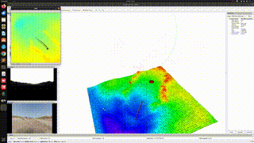

# HOUND
This repository serves as the cornerstone of the HOUND project. Note that as the HOUND project depends on several other repositories, this repository only contains instructions on installing the HOUND stack and instructions for running the minimal examples.

Note: 
1) The installation requires a few reboots, please save and close any work before starting this process.
2) These instructions have only been tested on the Nvidia Jetson Orin series hardware running Jetpack 5.1.2 and on an Ubuntu x86_64 machine running ubuntu 20.04.

### Hardware Requirements:
#### Setting up just the autonomy stack:
1) If installing on the HOUND, then [HOUND hardware](https://github.com/prl-mushr/hound_hardware). Otherwise, no additional hardware is required.
2) An internet connection

#### Requirements for running the BeamNG simulator:
1) The BeamNG simulator is run on a separate Windows computer. See [here](https://documentation.beamng.com/support/troubleshooting/requirements/) for the system requirements to run BeamNG.
2) Full duplex ethernet cable.
3) BeamNG also has experimental support for running the simulator on an Ubuntu host, however, this at the moment does not support the camera and LiDAR sensors.

### Environment setup for Running Autonomy stack on Ubuntu x86_64 (Autonomy stack installation not supported on MacOS or Windows):
Step 1: [Install docker](https://docs.docker.com/desktop/install/debian/#install-docker-desktop)

Step 2: [Install Nvidia Docker2](https://docs.nvidia.com/datacenter/cloud-native/container-toolkit/install-guide.html#installing-on-ubuntu-and-debian)

### Environment setup for Jetson:
Follow the instructions [here](https://github.com/prl-mushr/hound_hardware) to set up your Nvidia Orin NX.

### Installing HOUND stack:
Step 1:
```bash
mkdir catkin_ws && cd catkin_ws && mkdir src && cd src
git clone -b noetic-HOUND https://github.com/prl-mushr/mushr
```

Step 2: Executing the following command will prompt you to answer three questions
1) "Are you installing on robot and need all the sensor drivers? (y/n) " -- say yes, this should not produce a conflict even if you're on a desktop.
2) "download HOUND/field-robotics related repositories? (y/n) " -- say yes
3) "Build from scratch? (Not recommended, takes much longer than pulling ready-made image) (y/n) " -- say no.
Building the docker from scratch is possible but not recommended for now.
```bash
cd ~/catkin_ws/src/mushr/mushr_utils/install/
./mushr_install.bash
sudo reboot
```

Step 3: The following command is used to start the docker. On the first run, this will pull the docker image, which is approximately 20 GB in size, and so can take between 10 minutes and an hour depending on your internet connection speed.
```bash
mushr_noetic
```

Step 4: Once inside the docker, build the catkin workspace:
```bash
cd ~/catkin_ws/ && catkin build
```

This concludes the installation of the hound's autonomy stack.

### Installing the simulator integration:
The docker install pulls the BeamNG integration code, however, there are some additional setup steps. Follow the instructions on [BeamNGRL](https://github.com/prl-mushr/BeamNGRL) to set up the BeamNG simulator integration.
Note that you will need to git clone BeamNGRL on the Windows host as well to start the simulator on it.

### Testing the stack in HITL mode:
The HITL unit test is useful for testing your entire stack before you go for a real-world field test. It runs the autonomy stack in ROS as if it was running with real hardware data, communicating the control outputs to the simulator.

1) Make sure the computer running the autonomy stack and the one running the simulator are connected via the ethernet cable. On the computer running the autonomy stack:
```bash
ping <IP_ADDRESS_OF_WINDOWS_COMPUTER>
```
You should see a valid ping, with a latency of less than or equal to 1 millisecond

2) On the Windows computer, go to the directory containing BeamNGRL:
```bash
cd PATH/TO/BeamNGRL/examples
python boot_beamng.py
```

3) On the computer running the autonomy stack, start the docker: 
```bash
mushr_noetic
```

Now, run the following to start the HITL unit test:
```bash
cd ~/catkin_ws/src/hound_core
./unit_test.bash <IP_ADDRESS_OF_WINDOWS_COMPUTER>
```

You should see the following on your autonomy computer's screen:



Note: The MPPI may not follow the desired trajectory exactly, and the car may spin out. This may happen because of the car being used by the HITL simulation has different tire parameters than the ones being assumed by the MPPI model.

#### In case the map looks weird/caved, you need to reset the map:
```bash
rosservice call /elevation_mapping/clear_map
```
This concludes running the HITL unit test.

## Datasets:
Several datasets were collected during the testing of the HOUND hardware.
First few datasets collected using the HOUND hardware: 
1) [new_bags_1](https://drive.google.com/drive/folders/1sS3eayuNPIDPXBG4Ejq77Rzc-OpJaYks?usp=sharing)
2) [new_bags_2](https://drive.google.com/drive/folders/1CcIw9SoD6V5kblfzP96k5vfq1-5Uju_v?usp=sharing)

Datasets collected using the d455 instead of the d435 camera:
1) [new_bags_3](https://drive.google.com/drive/folders/1dut0QQscM1zGSM1hDTDna4EqMtbCVdnB?usp=sharing) -- This dataset is not particularly useful, as we were experimenting with region of interest settings on the camera, and ended up saturating the camera sensor in most of the frames. The dataset is only included in case someone wants to tally the kilometers operated by the system.
2) [new_bags_4](https://drive.google.com/drive/folders/12D8AFurK10BF6UKG0dReFFSA7qQtGr2w?usp=sharing)
3) [new_bags_5](https://drive.google.com/drive/folders/1w7_21CfkHCaU1jUW_0Nw0ZIm3knlXst0?usp=sharing)

Datasets collected for evaluating simulator accuracy:
[new_bags_6](https://drive.google.com/drive/folders/1mX6f5TXzX6WHbrv4zwV3bbimhbbg5moI?usp=sharing)


