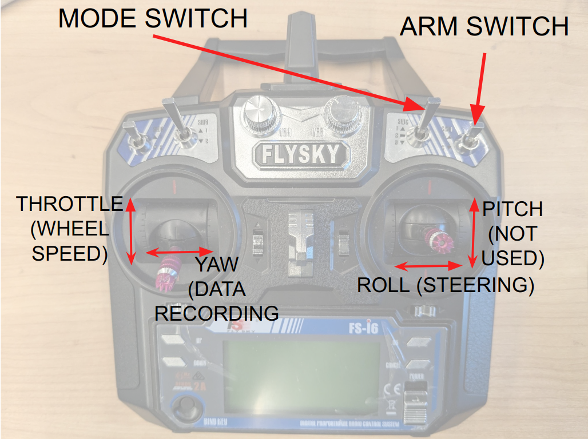
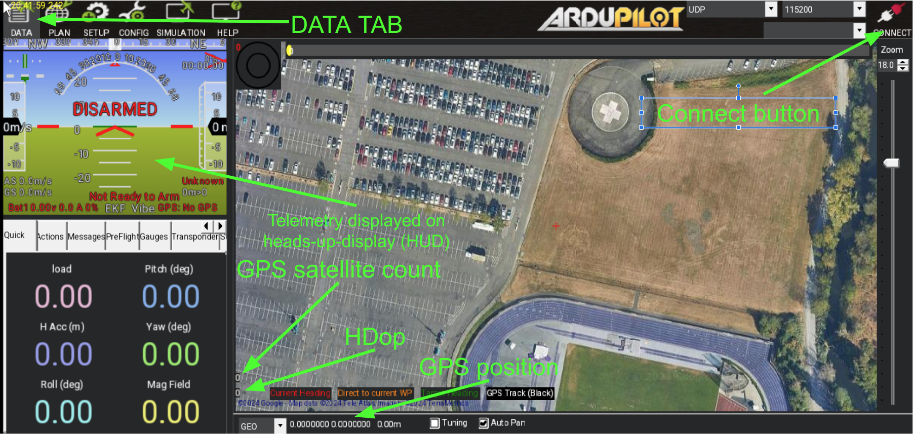

### Using the stack:
#### Automatically starting the software stack on boot AKA hands-free operation:
#### Note: When running/testing the autonomy mode, please make sure to connect the battery to the VESC
1. The setup you performed during installation using `mushr_install.bash` creates a `systemd` service that can automatically start the docker on boot. However, this service must be enabled by you by executing:
```bash
sudo systemctl enable mushr_start.service
```

2. To have the hound-core stack and the perception system start on boot, you will need to edit the [mushr_noetic](https://github.com/prl-mushr/mushr/blob/noetic-HOUND/mushr_utils/install/mushr_noetic) docker file by commenting out the bash starting lines and uncommenting the line that starts docker in a detached mode.
In essence, you need to change this:
```bash
xhost +local:docker
docker-compose -f $MUSHR_INSTALL_PATH/$MUSHR_COMPOSE_FILE run -p 9090:9090 --rm mushr_noetic bash
xhost -local:docker

# docker-compose -f $MUSHR_INSTALL_PATH/$MUSHR_COMPOSE_FILE run -p 9090:9090 -d --rm mushr_noetic /root/catkin_ws/src/hound_core/entry_command.sh
```
To this:
```bash
# xhost +local:docker
# docker-compose -f $MUSHR_INSTALL_PATH/$MUSHR_COMPOSE_FILE run -p 9090:9090 --rm mushr_noetic bash
# xhost -local:docker

docker-compose -f $MUSHR_INSTALL_PATH/$MUSHR_COMPOSE_FILE run -p 9090:9090 -d --rm mushr_noetic /root/catkin_ws/src/hound_core/entry_command.sh
```

For the communication between your phone, laptop and so on to work correctly, your phone needs to set up a WiFi hotspot that the car's computer will connect to.
Create a wifi hotspot on your phone, look up the IP Address of your phone on it, and set that as the value [here](https://github.com/prl-mushr/hound_core/blob/main/launch/apm.launch#L6)
```xml
		<arg name="gcs_url" default="udp://:14550@<IP_ADDRESS>"/>
```
At the same time, use `ifconfig` to find the IP_ADDRESS of the car on the phone's hotspot:
```bash
wlo1: flags=4163<UP,BROADCAST,RUNNING,MULTICAST>  mtu 1500
        inet <IP_ADDRESS> .... 
```
This address will be useful for ssh-ing into the car. 

It is possible that the phone's WiFi hotspot does not have good range.
Check if the `.bashrc` is using `127.0.0.1` as the ROS_IP. 
The older version of the docker uses the WiFi based ROS IP, which can create issues if the wifi range is not sufficient.
You can set the correct ROS_IP by adding the following line to the `.bashrc`:
```bash
export ROS_IP=127.0.0.1
``` 
alternatively, you could "re-pull" the docker to get the latest changes which includes this change:
```bash
docker image pull mushr/hound:aarch64
```
If you're pulling the docker image for the first time after reading these instructions, the ROS_IP has already been set correctly for you.

Now, when you reboot the system, it should automatically start the docker, as well as the sensor nodes and the elevation mapping stack. 

Note: We recommend using the D455 instead of the D435 camera as the depth perfromance of the D435 is only good up to 3-5 meters and the launch files need to be adjusted accordingly:
1) Change [this line](https://github.com/prl-mushr/hound_core/blob/main/launch/sensors.launch#L7) to use d435 instead of d455
2) Change the maximum depth [here](https://github.com/prl-mushr/elevation_mapping_cupy/blob/main/elevation_mapping_cupy/config/D455_parameters.yaml#L78) to 5.0 meters. 

#### Familiarize yourself with the R/C remote:

Assuming you've followed the transmitter setup [here](https://github.com/prl-mushr/hound_hardware?tab=readme-ov-file#setting-up-the-hardware),
1) Arm switch: This switch, in the high position, disarms the vehicle, and in the low position, arms the vehicle.
In the disarmed mode, only the steering may function, and the motor control is disabled; this mode is useful when you wish to leave the car unattended for a while, or if you just want to prevent unintentional throttle input from causing havoc.
This is the ultimate "e-stop" in the hands of the user. If the car is currently moving and is disarmed, the wheelspeed will be brought to 0 immediately. The steering should still be controllable.
2) Mode switch: This swtich controls which mode the system is operating in. 
	1) Manual mode: Putting the switch to the heighest position puts it in manual control mode. 
	The controls from the transmitter are being written directly to the motor and steering, the jetson is not involved.
	This mode works even with the jetson turned off, and is kept as a last-resort in case if the low-level controller also fails or the jetson turns off mid-experiment.
	2) Semi-autonomous mode/safe mode: Putting the switch to the middle position puts the car in "safe" mode.
	This requires the low-level controller to be running, meaning this does not work unless the jetson is powered up.
	In this mode, the throttle input corresponds to a wheelspeed target, which is managed by the low-level controller (PID + feed forward) and the steering input is corrected by the rollover prevention system.
	Additionally, a naive lidar-based safety controller also runs in this mode which sets the wheelspeed target to 0 if there is something in front of the lidar within some set distance (usually set to ~0.5 meters).
	3) Autonomy mode: Putting the switch into the lowest position puts the car into "autonomy" mode.
	In this mode, the steering input on the transmitter has no impact on the car, but the throttle stick still corresponds to the maximum allowable wheel-speed. This allows the user to slowly increase the allowable wheelspeed as they gain more confidence in the autonomy stack they have developed. This speed limit is enforced by the low level controller.
	Rollover prevention is also active in this mode.
	Lidar safety controller also remains active in this mode.
1) Throttle: Depending on the mode, the throttle controls either the raw duty cycle (manual mode), the wheelspeed (semi-auto) or the wheelspeed limit (auto). 
2) Yaw: This stick is used to turn the data collection on and off. Turning it right starts data collection, turning it left turns data collection off. The data collection on-off can also be mapped to the pitch stick.
3) Pitch: This stick is currently unused.
4) Roll: This stick controls the steering angle in the manual mode and semi auto mode, but does not control it in the autonomy mode.


#### Configuration files:
For initial usage, the user should not need to modify the config files, but we give a high level overview of what can be configured by the user.
1) [Low level config](https://github.com/prl-mushr/hound_core/blob/main/config/low_level_Config_real.yaml): This file exposes parameters relevant to rollover prevention and speed control
2) [Hardware abstraction layer config](https://github.com/prl-mushr/hound_core/blob/main/config/HAL.yaml): This file exposes parameters relevant to the configuration of sensors, where the data is stored and so on.
3) [MPPI/high level controller config](https://github.com/prl-mushr/hound_core/blob/main/config/hound_mppi_real.yaml): This file exposes parameters relevant to the high level controller, which in this case is the MPPI controller.


#### Your first run with the car:

We highly recommend running the car in semi-auto mode first and recording the data to visualize the elevation maps before trying the autonomy mode.

1) For your first experiment, go to a relatively open area/field. Turn on your phone's hotspot and start the car. You should be able to ssh into the car after a while
2) Wait for the sensors.launch to finish booting up. You can check whether everything is up and running by using ssh and typing `rostopic echo /SOC_diagnostics`. It should save True for mavros_init and camera_init. Alternatively, if you don't have a laptop with you (usually the case when just doing data collection), you can listen in for the "tones".
	1) Tone for when the [low-level controller](https://firmware.ardupilot.org/Tools/ToneTester/#MLO2L2A) is up and running.
	2) Tone for when the [GPS has a "bad lock"](https://firmware.ardupilot.org/Tools/ToneTester/#MSO3L8ddP8dd) or initial lock.
	3) Tone for when the [GPS has achieved a good lock](https://firmware.ardupilot.org/Tools/ToneTester/#MSO3L8dP8d) (usually happens after the bad lock)
	4) Tone for when the [camera has started running](https://firmware.ardupilot.org/Tools/ToneTester/#MLO2L2C) (happens last, approximately 2 minutes after boot)
3) On your phone start the [Mission planner app](https://play.google.com/store/apps/details?id=com.michaeloborne.MissionPlanner&hl=en_US&pli=1) or [QGC](https://apps.apple.com/us/app/alta-qgroundcontrol/id1447536334)(if you're on iPhone. It may not have all the functionality, but it will do). If the IP Addresses are set up correctly, the mission planner/QGC should automatically connect to the car on boot. If it does not, you can connect the mission planner to the vehicle manually by pressing on the "connect" button on the top left and just going with the default settings for all the prompts.

4) Wait for the GPS satellite count to be more than 12 (I prefer at least 16 satellites before I start my experiments). The Hdop should be around 1.0 m or less. Sometimes solar flares interfere. You can check if solar flares are going to interfere with GPS [here](https://www.swpc.noaa.gov/products/planetary-k-index).
5) On the transmitter, there are set SWC to the middle position (semi-auto mode), and set SWD to the lowest position (arming).
6) The car is now in semi-auto mode where it will do speed control and rollover prevention. Slowly increase the throttle and drive the car around manually. You should observe that the car does not let you turn very hard as you increase speed -- it is actively trying to prevent roll-overs.
7) To record rosbags of the data, move the yaw stick towards the right -- you should hear [this tone](https://firmware.ardupilot.org/Tools/ToneTester/#MLO3L8CD).
8) To stop the rosbag record, move the yaw stick towards the left -- you should hear [this tone](https://firmware.ardupilot.org/Tools/ToneTester/#MLO3L8DC).
9) The rosbags are automatically split into chunks that are 5 minutes long if you forget to turn the recording off, or if you try to record for a long amount of time. You can change the chunk size [here](https://github.com/prl-mushr/hound_core/blob/main/src/HAL_9000.py#L130C41-L130C50).
10) Drive the car around for a bit. If you drive it around enough, you will eventually drain the battery, and hear [this alarm tone](https://firmware.ardupilot.org/Tools/ToneTester/#MSO3L8dddP8ddd) that tells you that the battery is about to reach its minimum safe voltage (and that you should shut the car down). It is annoying on purpose.

After the field test, it is time to visualize the data we collected and verify that everything is functioning correctly.
  
1) Connect a monitor, mouse, and keyboard to the car's Orin NX (you can use a wireless keyboard and mouse). Start the car
2) Open a terminal and type: "docker kill $(docker ps -q)". This will kill the current docker.
3) Reset the mushr_noetic file to:
```bash
xhost +local:docker
docker-compose -f $MUSHR_INSTALL_PATH/$MUSHR_COMPOSE_FILE run -p 9090:9090 --rm mushr_noetic bash
xhost -local:docker
# docker-compose -f $MUSHR_INSTALL_PATH/$MUSHR_COMPOSE_FILE run -p 9090:9090 -d --rm mushr_noetic /root/catkin_ws/src/hound_core/entry_command.sh
```
4) Start mushr_noetic -- this time it will not start the sensors, it will just create a bash terminal into the docker.
5) Start roscore
6) Open 2 more terminals, and type "dbash" in both of them -- this opens new windows into the existing docker. "dbash" is just an alias for "docker exec -it $(docker ps -q) bash".
7) In the second terminal 
```bash
cd ~/catkin_ws/src/bags
rosparam set use_sim_time true
rosbag play hound_#.bag --clock
```
Where # represents the bag number you want to play
8) In the third terminal, type 
```bash
rviz -d /root/catkin_ws/src/hound_core/rviz/mppi_rviz.rviz
```
9) You should now be able to visualize an elevation map, with the vehicle in the center. Similar to the following image:


#### Your first autonomy test with the car:
For autonomous operation, We use the mppi and mission planner as follows

1) Follow steps 1-4 from the previous section (getting the car up and running, making sure it has enough GPS satellites and so on).
2) In mission planner, go to the [plan tab](https://ardupilot.org/planner/docs/common-planning-a-mission-with-waypoints-and-events.html) and set up the waypoints you want the car to follow. These waypoints can be 5-10 meters away from each other, and the car will automatically create Bezier splines that connect these points smoothly (global planner that plans through these waypoints is a WIP). You can also save the waypoints in the same tab so that you don't have to repeat this step for the same path each time.

2) Write the waypoints (there should be a button for this). 
3) SSH into the car, then type `dbash` in the terminal to enter the docker, and run the following command to start the MPPI controller.
```bash
rosrun hound_core hound_hl_control.py
```
4) In the mission planner's plan tab, read the waypoints -- this makes the ardupilot board republish the waypoints so that the mppi controller can also read them.
5) The mppi controller will now have a path through the waypoints that it can follow.
6) Set the mode stick on the RC transmitter to the position corresponding to the guided auto. If you're using the same RC transmitter as me, this would mean setting SWC to the lowest position. Then, arm the vehicle by pulling down on SWD. (TODO: insert image)
7) Slowly increase the throttle -- the car should start moving autonomously to follow the waypoints -- in the autonomy mode, the throttle stick still controls the maximum wheelspeed that the MPPI controller (or any policy) can send to the motor; this is done for safety reasons. If you're trying to train an RL agent, this will likely break some assumptions, and you may have to modify the code so that the speed is not restricted by the throttle stick.
8) Observe the motion of the vehicle -- if the vehicle does something unexpected or bad, you can always 
	1) pull down the throttle to reduce the speed 
	2) disarm the vehicle by flicking the SWD to the top position. Disarming the vehicle also resets the elevation map process.
